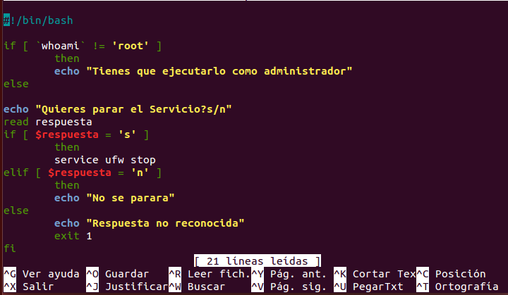
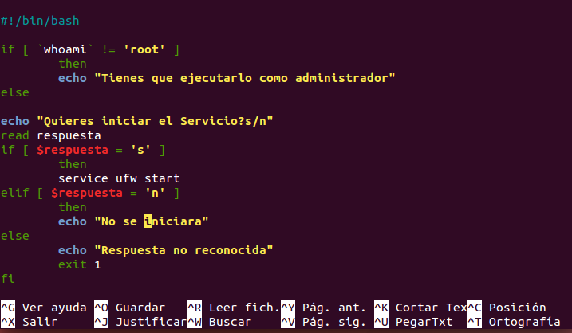
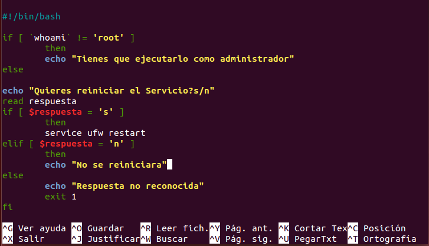
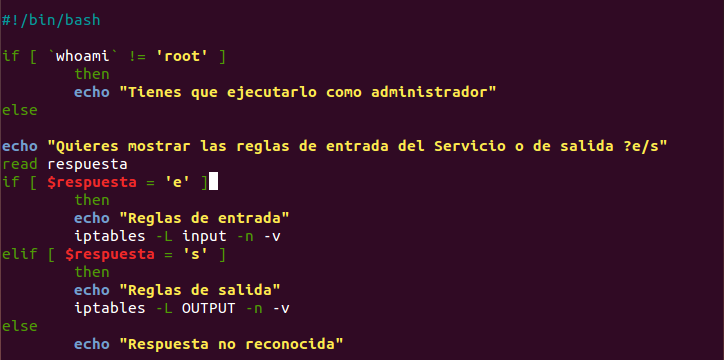
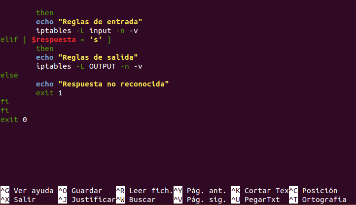

# ipTables
Usamos el comando ufw porque en ubuntu no nos permite usar iptables como comando

IPTABLE PARA PARAR EL FIREWALL

IPTABLE PARA INICIAR EL FIREWALL

IPTABLE PARA REINICIAR EL FIREWALL

IPTABLE PARA SABER LA CONFIGURACION DE ENTRADA Y SALIDA DEL FIREWALL

